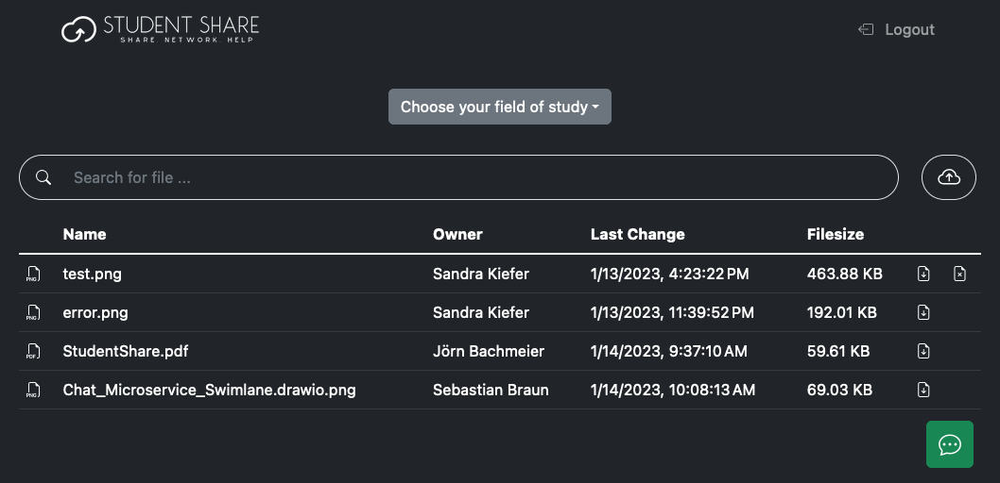
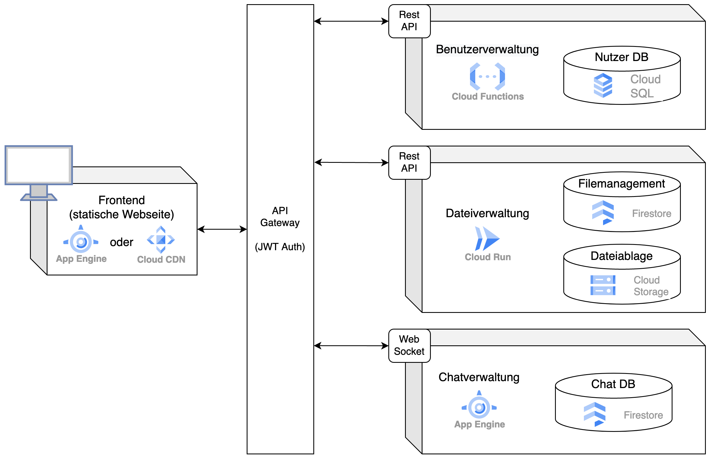

# StudentShare
Hochschule RheinMain - Informatik (Master of Science) - CloudComputing - Wintersemester 2022/2023  
Gruppenmitglieder: **Jörn Bachmeier, Sebastian Braun, Sandra Kiefer**

## Projektbeschreibung (Webanwendung in der Google Cloud)

Das Projekt wurde im Rahmen der Lehrveranstaltung Cloud Computing realisiert. Es umfasst eine Webanwendung mit entsprechenden Endpunkten im Backend zur Dateiverwaltung im Studium. Der Code ist für die Google Cloud entwickelt worden. Zudem wurden verschiedene Aspekte berücksichtig, wie zum Beispiel das Ausnutzen möglichst vieler verschiedener Technologien der Cloud, die automatische Skalierbarkeit und ein bestmögliches Sicherheitskonzept. 

Die Webanwendung kann unter folgendem Link aufgerufen werden:
https://website-dot-studentshare.ey.r.appspot.com

## Aufbau Komponenten

Die einzelnen Komponenten / Microservice des Projekts und deren Zusammenspiel sind im untenstehenden Diagramm näher aufgezeichnet.

Die ausführliche Dokumentation des Projektes ist zu finden unter dem Pfad "/documentation/docs/StudentShare.pdf".
